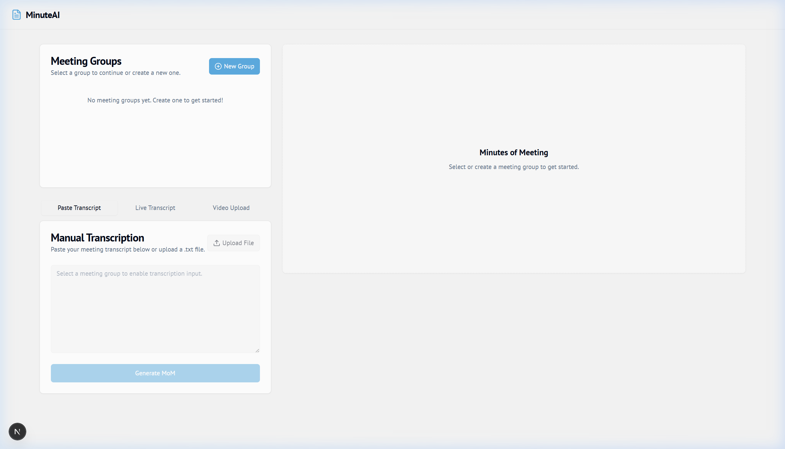
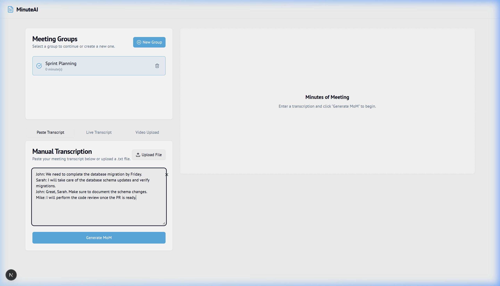

# MinuteAI

MinuteAI is a modern, AI-powered **Minutes of Meeting (MoM) Assistant** built with **Next.js**, **React**, **Tailwind CSS**, and **Google Genkit**. It leverages Gemini to analyze transcripts, generate structured minutes, extract action items (with owners and deadlines), and track historical meeting context.

---

## 📷 Screenshots

### 1. Welcome & Project Dashboard


### 2. Meeting Workspace & Transcript Editor


---

## Key Features

*   **Meeting Group Organizer:** Manage different meeting streams or projects (e.g., "Sprint Planning", "Product Sync") in one sidebar.
*   **Flexible Transcription Input:**
    *   **Paste Transcript:** Directly copy-paste text transcriptions from platforms like Zoom, Teams, or Google Meet.
    *   **Live Transcription:** Capture real-time audio from your microphone to transcribe discussions on the fly.
    *   **Video Upload:** Upload recorded video files to transcribe their audio content automatically.
*   **AI-Powered MoM Generation:** Uses `gemini-2.5-flash` via Google Genkit to output:
    1.  **Summary:** A concise outline of discussion points and decisions.
    2.  **Minutes of Meeting:** A detailed, formatted narrative of the conversation.
    3.  **Action Items:** Specific TODOs extracted with assigned owners and deadlines.
*   **Historical Continuity:** Automatically remembers the previous meeting's MoM to contextually generate the next one, ensuring continuity.
*   **Interactive Refining:** Edit and refine the generated summaries, minutes, and action items directly in the UI.
*   **Export & Storage:** Save the minutes to local storage or download them as structured Markdown (`.md`) files.

---

## Tech Stack

*   **Framework:** [Next.js](https://nextjs.org/) (App Router, Turbopack)
*   **Styling:** [Tailwind CSS](https://tailwindcss.com/) & [shadcn/ui](https://ui.shadcn.com/)
*   **AI SDK:** [Google Genkit](https://firebase.google.com/docs/genkit)
*   **Model:** `googleai/gemini-2.5-flash`
*   **Icons:** [Lucide React](https://lucide.dev/)

---

## Getting Started

### Prerequisites

Ensure you have [Node.js](https://nodejs.org/) installed (v18 or higher recommended).

You will also need a **Gemini API Key**. Get one from [Google AI Studio](https://aistudio.google.com/).

### Installation

1.  Clone the repository:
    ```bash
    git clone https://github.com/Niranjan-guru/MinuteAI.git
    cd MinuteAI
    ```

2.  Install dependencies:
    ```bash
    npm install
    ```

3.  Configure your environment variables. Create a `.env.local` file in the root directory and add your Gemini API Key:
    ```env
    GEMINI_API_KEY="your-gemini-api-key-here"
    ```

### Running the App

Start the development server:

```bash
npm run dev
```

Open [http://localhost:9002](http://localhost:9002) in your browser to view the application.

---

## Project Structure

*   `src/app/` — Application pages and global styles.
*   `src/components/` — Reusable React components (UI components, headers, meeting managers).
*   `src/ai/` — Genkit configuration and AI flows (MoM generation, key point summarization).
*   `src/hooks/` — Custom React hooks (e.g., local storage management).
*   `src/lib/` — Helper functions, types, and server actions.
*   `docs/` — Project blueprint and documentation assets.
